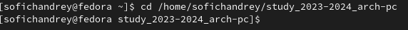
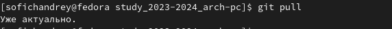

---
## Front matter
title: "Лабораторная работа №3."
subtitle: "Язык разметки Markdown"
author: "Софич Андрей Геннадьевич"

## Generic otions
lang: ru-RU
toc-title: "Содержание"

## Bibliography
bibliography: bib/cite.bib
csl: pandoc/csl/gost-r-7-0-5-2008-numeric.csl

## Pdf output format
toc: true # Table of contents
toc-depth: 2
lof: true # List of figures
lot: true # List of tables
fontsize: 12pt
linestretch: 1.5
papersize: a4
documentclass: scrreprt
## I18n polyglossia
polyglossia-lang:
  name: russian
  options:
	- spelling=modern
	- babelshorthands=true
polyglossia-otherlangs:
  name: english
## I18n babel
babel-lang: russian
babel-otherlangs: english
## Fonts
mainfont: PT Serif
romanfont: PT Serif
sansfont: PT Sans
monofont: PT Mono
mainfontoptions: Ligatures=TeX
romanfontoptions: Ligatures=TeX
sansfontoptions: Ligatures=TeX,Scale=MatchLowercase
monofontoptions: Scale=MatchLowercase,Scale=0.9
## Biblatex
biblatex: true
biblio-style: "gost-numeric"
biblatexoptions:
  - parentracker=true
  - backend=biber
  - hyperref=auto
  - language=auto
  - autolang=other*
  - citestyle=gost-numeric
## Pandoc-crossref LaTeX customization
figureTitle: "Рис."
tableTitle: "Таблица"
listingTitle: "Листинг"
lofTitle: "Список иллюстраций"
lotTitle: "Список таблиц"
lolTitle: "Листинги"
## Misc options
indent: true
header-includes:
  - \usepackage{indentfirst}
  - \usepackage{float} # keep figures where there are in the text
  - \floatplacement{figure}{H} # keep figures where there are in the text
---

# 1. Цель работы

Целью работы является освоение процедуры оформления отчетов с помощью легковесного
языка разметки Markdown.

# 2. Задание

Здесь приводится описание задания в соответствии с рекомендациями
методического пособия и выданным вариантом.

# 3. Теоретическое введение

Markdown — облегчённый язык разметки, созданный с целью обозначения форматирования в простом тексте, с максимальным сохранением его читаемости человеком, и пригодный для машинного преобразования в языки для продвинутых публикаций.

# 4. Выполнение лабораторной работы

После установки необходимых пакетов перехожу в каталог курса, созданный при выполнении прошлой лабораторной работы  (рис. @fig:001).

{#fig:001 width=70%}

Обновляю локальный репозиторий, используя команду команду "git pull" (рис. @fig:002).
{#fig:002 width=70%}

Перехожу в папку report третьей лаборатоорной работы, используя утилиту "cd" (рис. @fig:003).
[Перемещение в папку report](image/Снимок экрана от 2023-10-12 18-36-16.png){#fig:003 width=70%}

Компилирую шаблон, с помощью утилиты "make" создаю документ doxc (рис. @fig:004).
[файл doxc](image/Снимок экрана от 2023-10-12 18-54-46.png) {#fig:004 width=70%}

Создаю документ pdf (рис. @fig:005).
[файл pdf](image/Снимок экрана от 2023-10-12 18-54-56.png) {#fig:005 width=70%}

Проверяю сгенерированный doxc файл (рис. @fig:006).
[шаблон в doxc](image/Снимок экрана от 2023-10-12 18-55-32.png){#fig:006 width=70%}

Проверяю сгенерированный шаблон pdf (рис. @fig:007).
[шаблон в pdf](image/Снимок экрана от 2023-10-12 18-55-47.png){#fig:007 width=70%}

Удаляю полученные файлы с помощью команды "make clean" (рис. @fig:008).
[Удаление файлов](image/Снимок экрана от 2023-10-12 18-56-40.png){#fig:008 width=70%}

Проверяю правильность удаления(рис. @fig:009).
[Проверка правильности действий](image/Снимок экрана от 2023-10-12 18-56-54.png){#fig:009 width=70%}

Перемещаюсь в report.md и начинаю заполнять отчет(рис. @fig:010).
[Файл markdown](image/Снимок экрана от 2023-10-12 19-48-08.png){#fig:010 width=70%}

# Выводы

Здесь кратко описываются итоги проделанной работы.

# Список литературы{.unnumbered}

::: {#refs}
:::
