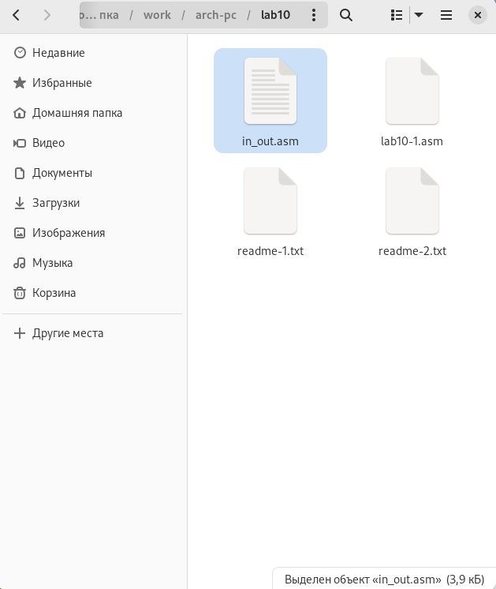
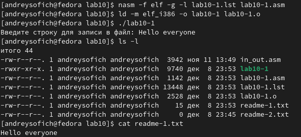
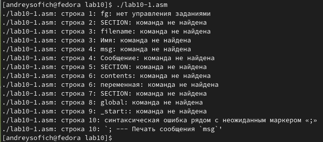
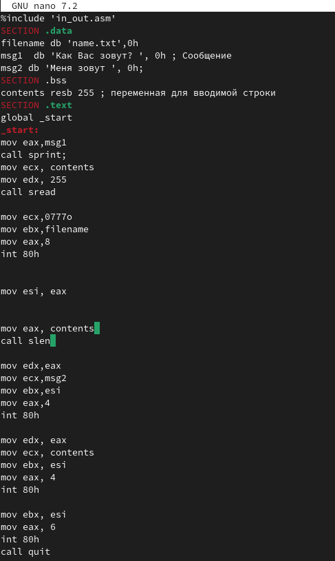

---
## Front matter
title: "Лабораторная работа №10"
subtitle: "Работа с файлами средствами NASM"
author: "Софич Андрей Геннадьевич"

## Generic otions
lang: ru-RU
toc-title: "Содержание"

## Bibliography
bibliography: bib/cite.bib
csl: pandoc/csl/gost-r-7-0-5-2008-numeric.csl

## Pdf output format
toc: true # Table of contents
toc-depth: 2
lof: true # List of figures
fontsize: 12pt
linestretch: 1.5
papersize: a4
documentclass: scrreprt
## I18n polyglossia
polyglossia-lang:
  name: russian
  options:
	- spelling=modern
	- babelshorthands=true
polyglossia-otherlangs:
  name: english
## I18n babel
babel-lang: russian
babel-otherlangs: english
## Fonts
mainfont: PT Serif
romanfont: PT Serif
sansfont: PT Sans
monofont: PT Mono
mainfontoptions: Ligatures=TeX
romanfontoptions: Ligatures=TeX
sansfontoptions: Ligatures=TeX,Scale=MatchLowercase
monofontoptions: Scale=MatchLowercase,Scale=0.9
## Biblatex
biblatex: true
biblio-style: "gost-numeric"
biblatexoptions:
  - parentracker=true
  - backend=biber
  - hyperref=auto
  - language=auto
  - autolang=other*
  - citestyle=gost-numeric
## Pandoc-crossref LaTeX customization
figureTitle: "Рис."
tableTitle: "Таблица"
listingTitle: "Листинг"
lofTitle: "Список иллюстраций"
lolTitle: "Листинги"
## Misc options
indent: true
header-includes:
  - \usepackage{indentfirst}
  - \usepackage{float} # keep figures where there are in the text
  - \floatplacement{figure}{H} # keep figures where there are in the text
---

# Цель работы
Приобретение навыков написания программ для работы с файлами.


# Задание
1. Задание лабораторной работы
2. Задание для самостоятельной работы


# Выполнение лабораторной работы

## Задание лабораторной работы

Создаю каталог для программ лабораторной работы №10, перехожу в него и создаю файлы: lab10-1.asm,readme-1.txt,readme-2.txt (рис. @fig:001).

{#fig:001 width=70%}

Перемещаю файл in_out.asm, так как он понадобится для дальнейшей работы (рис. @fig:002).

{#fig:002 width=70%}

Ввожу в файл lab10-1.asm текст программы из листинга 10.1. Чтобы программа работала, изменяю название файла,в котором будет отображаться моё сообщение (меняю readme.txt на readme-1.txt) (рис. @fig:003).

{#fig:003 width=70%}

Создаю исполняемый файл,ввожу с клавиатуры сообщение,которое переместится в файл readme-1.txt, после чего распаковываю данный файл и убеждаюсь,что мое сообщение находится именно там (рис. @fig:004).

{#fig:004 width=70%}

С помощью команды chmod изменяю права доступа к исполняемому файлу lab10-1, запрещая его выполнение во всех трех группах (пользователю,члену команды пользователя и всем остальным) и проверяю команду с помощью ls (рис. @fig:005).

{#fig:005 width=70%}

Пробую запустить исполняемый файл, но мне отказывают в доступе (рис. @fig:006).

{#fig:006 width=70%}

С помощью команды chmod изменяю права доступа к файлу lab10-1.asm с исходным текстом программы, добавляя права на исполнение для всех пользователей (рис. @fig:007).

{#fig:007 width=70%}

Совершаю проверку (рис. @fig:008). Так как исполняется просто файл с текстом,невозможно распознать команды,которые там прописаны.

{#fig:008 width=70%}

В соответствии с 12 вариантом из таблицы (--x -wx r-x; 001 011 101) предоставляю права доступа к файлу readme-1.txt в символьном виде (рис. @fig:009). А к readme-2.asm в численном (рис. @fig:010).

{#fig:009 width=70%}

{#fig:010 width=70%}

С помощью команды ls и ключа -l проверяю права у 1 файла (рис. @fig:011). И у 2 (рис. @fig:011).

{#fig:011 width=70%}

{#fig:012 width=70%}

## Задание для самостоятельной работы

Создаю новый файл lab10-2.asm для написание кода программы (рис. @fig:013).

{#fig:013 width=70%}

Пишу код программы,который работает по следующему алгоритму:
• Вывод приглашения “Как Вас зовут?”
• ввести с клавиатуры свои фамилию и имя
• создать файл с именем name.txt
• записать в файл сообщение “Меня зовут”
• дописать в файл строку введенную с клавиатуры
• закрыть файл
(рис. @fig:014)

```NASM
%include 'in_out.asm'
SECTION .data
filename db 'name.txt',0h
msg1  db 'Как Вас зовут? ', 0h ; Сообщение
msg2 db 'Меня зовут ', 0h;
SECTION .bss
contents resb 255 ; переменная для вводимой строки
SECTION .text
global _start
_start:
mov eax,msg1
call sprint;
mov ecx, contents
mov edx, 255
call sread

mov ecx,0777o
mov ebx,filename
mov eax,8
int 80h


mov esi, eax


mov eax, contents 
call slen 

mov edx,eax
mov ecx,msg2
mov ebx,esi
mov eax,4
int 80h

mov edx, eax
mov ecx, contents
mov ebx, esi
mov eax, 4
int 80h

mov ebx, esi
mov eax, 6
int 80h
call quit
```
{#fig:014 width=70%}

Запускаю программу и убеждаюсь,что она работает исправно (рис. @fig:015).

{#fig:015 width=70%}


# Выводы

В данной лабораторной работе я научился приобрёл навыки написания программ для работы с файлами.

# Список литературы{.unnumbered}

Лабораторная работа №10
